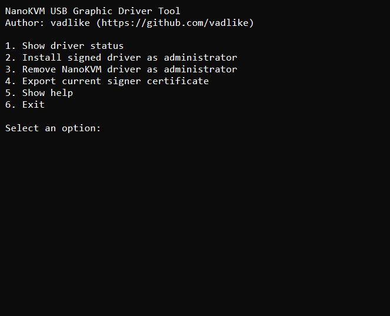
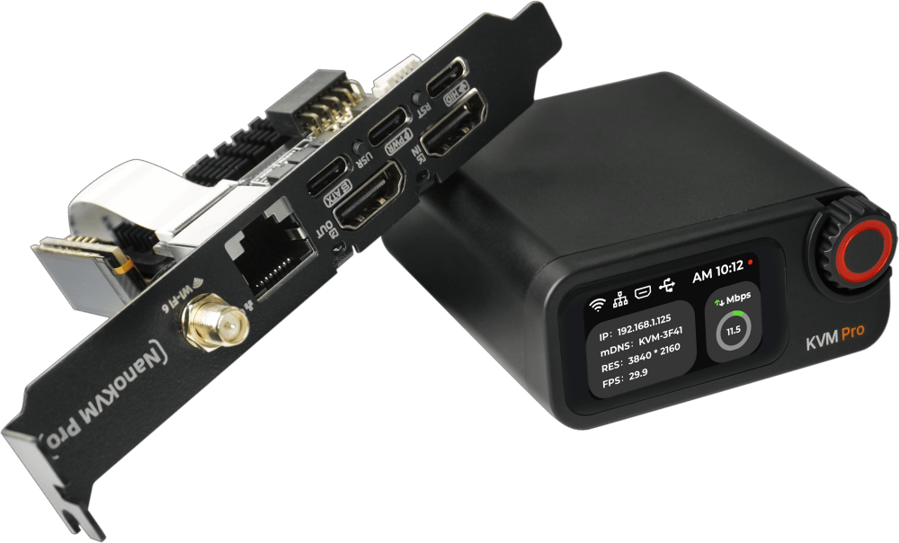

<h1 align="left">NanoKVMPro USB Graphic Driver Wrapper</h1>

<p align="left">
  <a href="https://github.com/vadlike/nanokvmpro-usb-graphic-driver-wrapper/releases/latest">
    
  </a>
  
  
  <a href="https://wiki.sipeed.com/hardware/en/kvm/NanoKVM_Pro/introduction.html">
    
  </a>
  
</p>

Modified Windows driver package for NanoKVM Pro with a simple installer menu.

This repository provides a ready-to-use package for installing and removing the NanoKVM Pro USB Graphic driver on Windows.


## Quick Start

Download the latest release:  
[Latest Release](https://github.com/vadlike/nanokvmpro-usb-graphic-driver-wrapper/releases/latest)

Official driver:  
[Sipeed Official Driver v1.0.5](https://github.com/sipeed/NanoKVM-Pro/releases/download/v1.0.5/nanokvmpro_usb_graphic_win.zip)

Run:

```bat
driver-tool.cmd
```

Menu actions:

- `1` show driver status
- `2` install the driver with UAC elevation
- `3` remove the driver with UAC elevation
- `4` export the current signer certificate

## Driver Tool

`bcdedit /set testsigning on` is **not required**.



## Why Use This Package

With `driver-tool.cmd`:

- no need to run `bcdedit /set testsigning on`
- no need to boot Windows in Test Mode
- the required certificate is installed automatically
- install and removal work from one menu

## What Is Included

- `driver-tool.cmd`
- `nanokvm_usb_graphic.inf`
- `nanokvm_usb_graphic.cat`
- `nanokvm_usb_graphic.dll`
- `tools/driver-tool.ps1`
- `tools/install-driver-elevated.ps1`
- `tools/remove-driver-elevated.ps1`
- `cert/nanokvm_usb_graphic-test.cer`

## Based On

Official Sipeed release asset:

`https://github.com/sipeed/NanoKVM-Pro/releases/download/v1.0.5/nanokvmpro_usb_graphic_win.zip`

The official archive contains only packaged driver files and does not include the original Windows driver source code.

Changes in this wrapper package:

- adjusted `INF` matching for `USB\VID_3346&PID_1009`
- rebuilt package for local installation
- re-signed package with a local test certificate
- added `driver-tool.cmd` for install and removal

## Notes

- this is a modified package, not the untouched official Sipeed release
- the signing certificate is a local test certificate, not a production WHQL signature
- intended for local and manual Windows installation

## Device



Image source: Sipeed Wiki  
https://wiki.sipeed.com/hardware/en/kvm/NanoKVM_Pro/introduction.html

